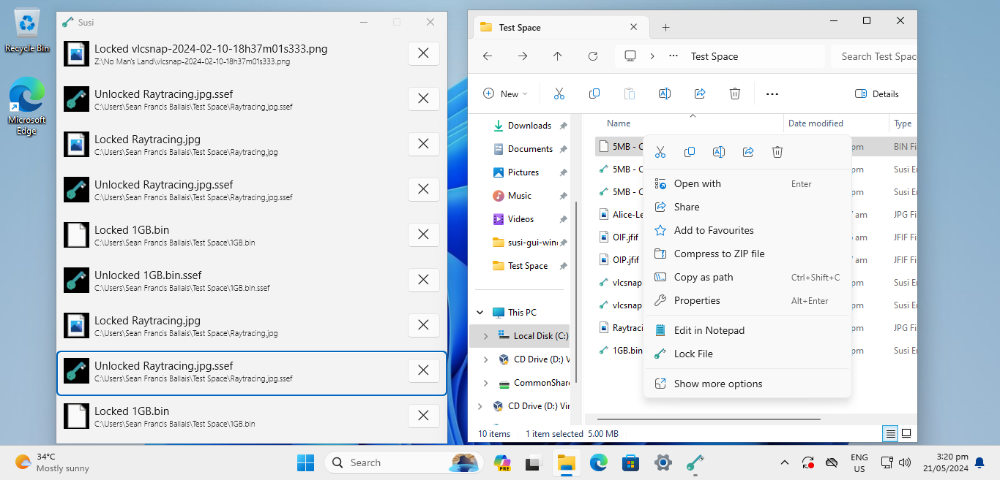
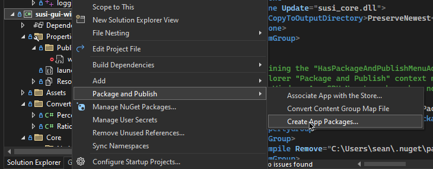

# Susi

Susi is a utitlity app by [Sean Ballais](https://seanballais.com) that lets you encrypt (and decrypt) files to protect them from unauthorized parties. This is considered to be alpha software, so **use this at your own risk**. **No warranty** is provided with this software.

https://github.com/seanballais/susi-gui-windows/assets/7175885/dfb927b5-2fe2-48f3-bc62-6c122612a579

_A demonstration of Susi._

## Supported Platforms
Susi fully supports Windows 11, but has partial support for Windows 10. Only file unlocking/decryption is supported in Windows 10 at the moment. Additionally, only 64-bit versions of the aformentioned operating systems are supported.

## Components
Susi is composed of two main components: (a) Susi GUI, and (b) Susi Core. Susi GUI is the GUI component of the app (this repository holds the code for the Windows version), while [Susi Core](https://github.com/seanballais/susi-core) is where most of the major operations, such as encryption and decryption, are done.

## Built With
Susi GUI is built with C# (.NET 8 and WinUI 3) and a small, but important, component in C++. Susi Core is built completely in Rust. The installer for Susi GUI is mostly built with [InnoSetup](https://jrsoftware.org/isinfo.php), with an internal script written in PowerShell.

## Development
Due to personal time constraints, a complete documentation on how to work on this project will not be available. However, the basic requirements are Visual Studio 2022, the .NET 8 SDK, and the Windows App SDK 1.5.

A DLL of [Susi Core](https://github.com/seanballais/susi-core) is also required. It must be compiled, and the resulting DLL (`susi_core.dll`) and its accompanying `.lib` file (`susi_core.dll.lib`) must be added to the `susi-gui-windows` C# project (stored in the inner `susi-gui-windows/` folder) of this app's solution. The DLL must be compiled in debug mode during development, but it must be compiled in release mode when you are working towards a distributable copy of Susi. You must also set the DLL file's "Copy to Output Directory" property in the C# project to "Copy if newer", when editing it via Visual Studio, or `PreserveNewest`, when directly editing the C# project file.

The app is built as a packaged application. Based on experience, this was the easiest way to build Susi while also using WinUI 3. This means that deployment is primarily done through MSIX. Packaging our app into an MSIX package is currently performed through Visual Studio tools (as shown below). If you want to distribute a version of Susi GUI (which is allowed by the [license](/LICENSE.md) of the app), it is recommended that you also do the same procedure. Distribution of the MSIX package will differ based on how it will be distributed. Please refer to [Microsoft's documentation](https://learn.microsoft.com/en-us/windows/msix/package/packaging-uwp-apps) for more information on that regard.

    

_Creating an MSIX package for Susi is currently done through Visual Studio tools._

## Installation
> **NOTE**: This section assumes that you are using the installer provided in [Sean Ballais's repository for Susi GUI (Windows)](https://github.com/seanballais/susi-gui-windows). The installation procedure for other distributions of Susi may differ.

Susi GUI is exported as an MSIX package. However, it depends on the latest Visual C++ 2022 Redistributable, .NET 8 Desktop Runtime, and Windows App SDK Runtime. A certificate is also required to allow sideloading/installing the app. These steps are cumbersome for users. So, to make the installation process easy, we are providing a setup file that is a chain installer. It does all the aforementioned steps on the behalf of the user.

You can simply grab a setup file from the [Releases](https://github.com/seanballais/susi-gui-windows/releases) page. Once you have a setup file, simply run it and follow the steps. You don't have to do much to install it! The demo below shows the installation process. Note that this is shortened since the dependencies were already instaleld.

https://github.com/seanballais/susi-gui-windows/assets/7175885/3ca1e26c-efc9-4fe2-aed3-f4cfc4bf6e11

_A demonstration on installing Susi in Windows._

We recommend restarting your machine, however, once the installation is done, so that our shell extension to the Windows Explorer gets loaded in. Alternatively, you can just restart Windows Explorer from the Task Manager.

One important thing to note is that Susi is installed using MSIX. So, it will be installed inside `C:\Program Files\WindowsApps`.

Beware that the app and installer are both alpha software. So, again, use at your own risk.

### Uninstallation
Uninstallation of Susi is simply done by uninstalling the app from the Start Menu or the Settings app.

https://github.com/seanballais/susi-gui-windows/assets/7175885/c7798475-c286-4a50-91bc-fe9fa0c43897

_Uninstalling Susi in Windows._

However, this only removes the app itself. You will have to manually uninstall the dependencies if you want them off of your machine. We don't necessarily recommend that since other apps may already be dependending on them.

The certificate for the app will still remain unless removed manually. You can remove it by performing the following steps:

1. Open "Manage user certificates" in the Control Panel. This can also be opened directly from the Start Menu.
2. Open "Trusted People" and then "Certificates".
3. Select the certificate that was issued by "Sean Francis N. Ballais", and either click on the red "X" button on the toolbar or right-click the selected item and click "Delete". You will be asked if you would like to delete the selected certificate. Press "Yes".
4. Done!

You may also view the demo below to learn how to remove the certificate.

https://github.com/seanballais/susi-gui-windows/assets/7175885/28afeada-90bf-4655-ae32-07951c9a16fa

_Removing the certificate that was added during the installation of Susi._

## Using Susi
Susi provides two features -- encryption _and_ decryption of files, both of which may also be referred to as "locking" and "unlocking" files, respectively. The app encrypts to and decrypts from a custom Susi Encrypted File (a `.ssef` file). It does not support any other encryption formats. You may check [Susi Software Specifications](#susi-software-specifications) to know where to learn about details on the custom `.ssef` file format.

### Encryption
Encrypting a file with Susi is easy. The following steps will guide you how to encrypt a file.

1. Simply select a file from the Windows Explorer or desktop.
2. Right-click the selected file, and select "Lock File".
3. Susi will show up and will ask for a password to encrypt the file. Enter the desired password for the file. You will have to enter the same password in the "Confirm Password" textbox.
4. After entering the password, Susi will start encrypting the file. It may take a while depending on your computer. After encryption is complete, the original file will be **removed** and you are left with an encrypted `.ssef` file in the **same directory** as the original file.

The following video provides a visual demonstration on how to encrypt a file with Susi.

https://github.com/seanballais/susi-gui-windows/assets/7175885/76ed61f2-e573-4aa9-af5d-f44eabbf3a3d

_Encrypting/Locking a file with Susi._

### Decryption
Decrypting a Susi Encrypted File with Susi is easy as well. Remember that Susi can only decrpyt a Susi Encrypted File (`.ssef` file). The following steps will guide you how to decrpyt a file.

1. Open a Susi Encrypted File (`.ssef` file) from Windows Explorer or the desktop. If you are asked to select a program to open the file with, make sure you select Susi and, as a recommendation, set it as the default app.
2. Susi will show up and will ask for the password used to encrypt the file. Enter the correct password for the file. Susi will inform you if you entered the wrong password.
3. After entering the password, Susi will start decrypting the file. It may take a while depending on your computer. After decryption is complete, the encrypted file will be **removed** and you are left with the original file with its original file name in the **same directory** as the encrypted file.

The following video provides a visual demonstration on how to decrypt a Susi Encrypted File with Susi.

https://github.com/seanballais/susi-gui-windows/assets/7175885/0b22f642-1928-4b06-8d02-afa4e9670fdc

_Decrypting/Unlocking a Susi Encrypted File._

### Remarks
Make sure you remember the password you set for a file when you encrypt it. You will **not** be able to decrypt it without the correct password. Additionally, note that a Susi Encrypted File is portable and can be renamed. However, upon decryption, it will revert back to its original file name.

## Susi Software Specifications
Software specifications for Susi have been written to guide us with the development of the project. It also contains the specifications of the file format of a Susi Encrypted File (`.ssef`). If you are interested in reading it or learning about the file format, you may obtain and read the latest specifications from the ["Releases" page of the software specifications's repository](https://github.com/seanballais/susi-software-specs/releases).

## License
This project, Susi GUI (for Windows), is licensed under the GNU General Public License v3. See [`LICENSE.md`](/LICENSE.md) for details.

Some parts of the app was based on third-party code. See [`THIRD-PARTY-LICENSES.txt`](/THIRD-PARTY-LICENSES.txt) for details. Some code used in this project are based from [StackOverflow](https://stackoverflow.com) answers. The credits for such usage are stored in the individual files with code that is based off of StackOverflow answers.

## Contact
Sean Francis N. Ballais - [@seanballais](https://twitter.com/seanballais) - [sean@seanballais.com](mailto:sean@seanballais.com)
